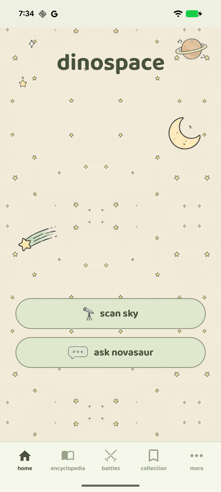
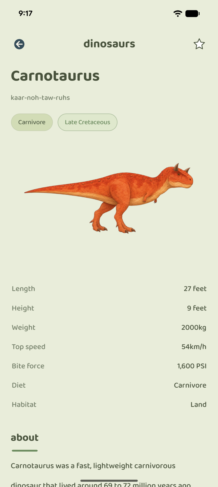
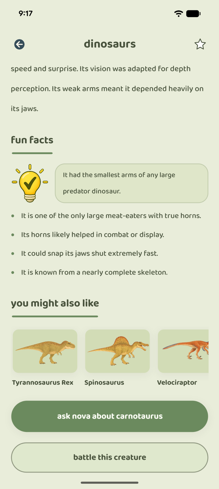
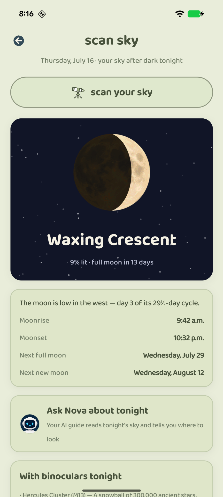
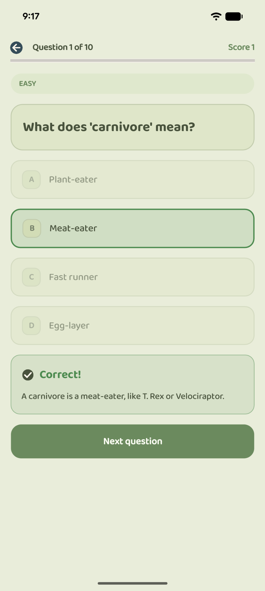
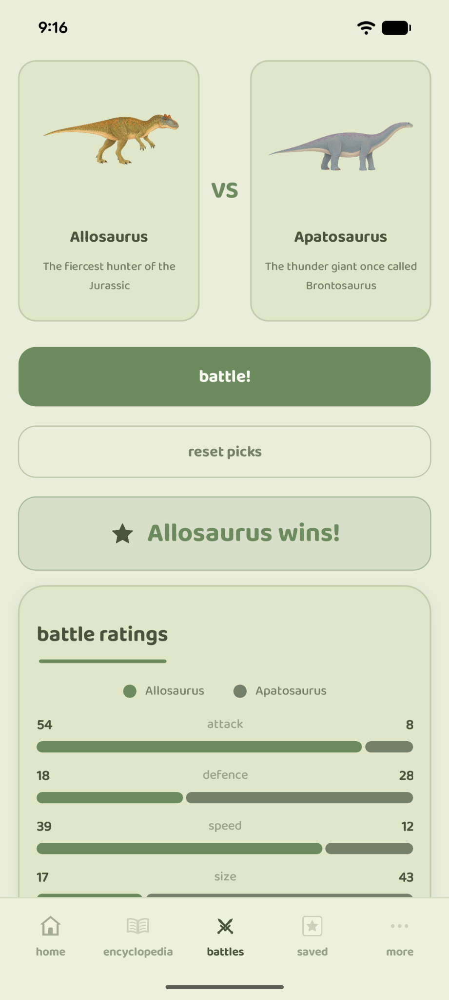
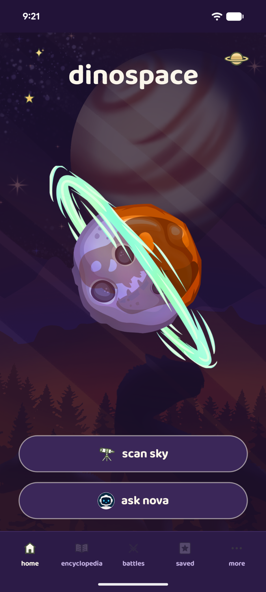
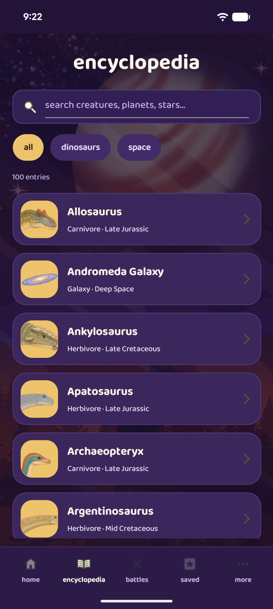
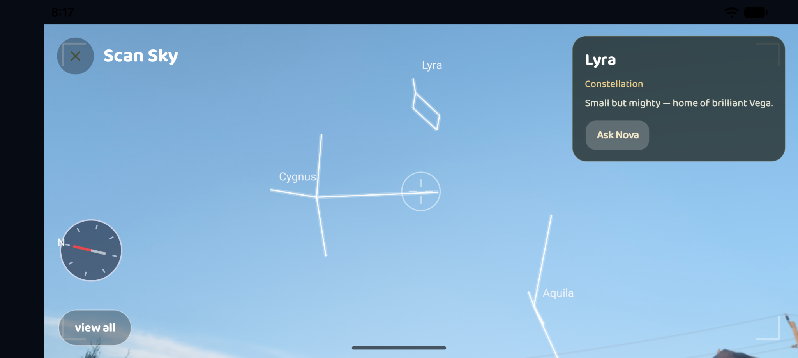

# DinoSpace

**A fully offline dinosaur & space encyclopedia for Android, with its own on-device AI and a live astronomy engine.** Built from scratch in C# with .NET MAUI.

DinoSpace blends the two things every kid (and plenty of adults) can't get enough of — dinosaurs and outer space — into one app that works with zero internet: a hand-written encyclopedia, an AI guide that runs entirely on the phone, and a personalized report of tonight's actual sky.

## A look around

<table>
  <tr>
    <td align="center"> <b>Home</b></td>
    <td align="center"> <b>Creature entries</b></td>
    <td align="center"> <b>Fun facts</b></td>
    <td align="center"> <b>Tonight's sky</b></td>
  </tr>
  <tr>
    <td align="center"> <b>Quizzes</b></td>
    <td align="center"> <b>Dino battle</b></td>
    <td align="center"> <b>Twilight theme</b></td>
    <td align="center"> <b>Encyclopedia</b></td>
  </tr>
</table>

   
  <b>Scan Sky — the live camera view with tonight's stars overlaid</b>

---

## Highlights

### 🦖 The encyclopedia
50 dinosaurs and prehistoric creatures, 50 space objects — 100 entries, every one hand-written and fact-checked against sources like NASA and published paleontology research. Stats, fun facts, behaviour, habitat, era, and full-page write-ups, with search, category filters, bookmarks, and curated ranked collections.

### 🔭 Scan Sky
Scan Sky opens on your personal sky report: the moon's phase drawn with the real terminator curve, moonrise and moonset, the next meteor shower with a moonlight forecast, which planets and constellations are above you and where to look, sunset/sunrise, and the moment the sky gets *properly* dark. All of it is computed on-device by [SkyScanner](https://github.com/Karthikeya0923/SkyScanner), an astronomy engine verified against NASA JPL's Horizons ephemeris to within a few hundredths of a degree. Location is optional — say no and you still get a general Northern-sky view. A built-in "Learn the sky" page explains every moon phase and how to tell a planet from a star.

Tap **scan your sky** and the live camera fills the whole screen (centre-cropped, no letterbox bars), overlaying ONLY what is genuinely above you right now: the sun, a phase-correct moon, all the planets drawn with their signature looks (Saturn's rings, Jupiter's cloud belts, Mars' polar cap) — and after dark, the bright named stars and their constellation figures. Nothing invented, nothing you couldn't really see. The target card names something only when the crosshair is truly on it, links into the encyclopedia, and offers **Ask Nova** for whatever you're aiming at. No camera falls back to a twilight-aware painted sky, and drag-to-explore works with no sensors at all.

### 🤖 Ask Nova
Nova — the app's dino guide — is an AI powered by Google's Gemma running locally through [NovaSaur](https://github.com/Karthikeya0923/novasaur), the inference engine built for this app. Anything askable by name answers **instantly** from the hand-checked encyclopedia and a 156-topic knowledge base that now covers space history too — the moon landings, Gagarin, Mars rovers, Voyager, the James Webb telescope, "will we ever go to Mars" — verified by an in-repo harness that runs **over a billion generated questions** (1,347,640,320 on the current build: every entry and alias × dozens of question shapes × the filler lead-ins, tails, casings and punctuation people actually type, plus every knowledge topic × its trigger wordings, every pairwise battle and distance, and typo gauntlets) through the production pipeline (`tools/AnswerHarness`), and passes with zero quality failures. Live sky questions ("where is Jupiter right now?", "when is the next meteor shower?") are answered by the astronomy engine with tonight's real answer — something a frozen language model could never know. Everything else goes straight to the model — there is no topic wall that bounces typed questions. Open-ended answers stream token by token, ChatGPT-style; the engine handles exactly one question at a time and reloads itself before each new one, so every answer starts on a completely clean slate and the chat can never hang or clog up. The model itself is optional: the chat works fully without it, and a card in the chat (and in Settings) downloads the 2.4 GB model in-app — resumable, pausable, removable.

### 🎨 Your Creations — draw your own
A proper little paint studio: real finger-drag freehand with five brushes (pencil, marker, wide marker, glow, rainbow), an eraser and a fill bucket, adjustable sizes, a colour palette with a custom R/G/B mixer, and undo/redo — with a live preview of the drawing above the details form so naming it never feels disconnected from what was just drawn. Then fill in a full entry — name, pronunciation, name meaning, era, diet, size/weight/speed/bite for a dinosaur (or type + four facts for a space object), plus About, Key features, Habitat, Behaviour and Fun facts — so your creation looks *identical* to a built-in encyclopedia entry. Creations get their own gallery, drop into your custom lists, and the dinosaurs you draw can march straight into **Dino Battle** with an "Include my creatures" toggle — your drawing and all. Drawings export with a **transparent background**, so everywhere one appears — gallery, entry page, battle arena, list thumbnails — only what was actually painted floats on the page, exactly like the built-in art. Creations open as a full entry page identical to the real ones, and can be edited or deleted any time. (They're yours, so there's no Ask-Nova button, and they stay out of Surprise Me.)

### 🎮 Play
Quizzes (5 to 100 questions, dinosaurs / space / mixed), Dino Battles with stat-driven verdicts that argue each matchup like a sports column, daily featured creatures, a **Surprise Me** button that pulls a creature or world you haven't met yet, and streak + discovery counters to keep explorers coming back.

### 🪄 The storybook look
One hand-drawn storybook design language across the whole app — lowercase Baloo headlines, soft sage pill cards with fine olive outlines, sticker-sheet illustrations, and hand-drawn icon slots waiting for original art — dressed by **four full themes**: **soft pastel** (the signature plain page), **meadow grid**, **daydream clouds**, and **dinospace** — the hand-painted twilight artwork made for the app. Switch under Settings → Appearance; the whole app re-skins with a seamless cross-fade.

---

## Engineering notes

- **All-C# UI** — every screen is built in code (no XAML pages), on a small component kit with design tokens. The **theme** (palette + wallpaper) switches at runtime and re-skins the whole app with a freeze-frame cross-fade; dark themes swap the full palette so nothing ever sits black-on-black.
- **Instant-first answering** — a typo-tolerant matcher (aliases, edit distance, kid abbreviations) routes questions to the encyclopedia, the knowledge base, or the live astronomy engine before the model is ever considered; follow-up pronouns ("how fast was *it*?") resolve against the last-mentioned entities. Everything else goes straight to the model — one question at a time, with a full engine reload before each new question so the small model always starts clean.
- **On-device drawing** — the Your Creations studio captures finger-strokes via pointer events, renders them live through `Microsoft.Maui.Graphics`, and rasterises to a PNG with a native Android canvas; creations convert into the same models the built-in encyclopedia uses, so they battle and list like any other entry.
- **2.4 GB model delivery** — the AI model ships via Google Play Asset Delivery in 1 GB chunks and assembles on first run; a resumable in-app download (with pause/resume, storage preflight, and a remove-to-free-space option in Settings) covers every other install. No notification or foreground-service permissions needed.
- **True edge-to-edge** — window insets are intercepted natively so the tab bar and chat input reach the physical bottom edge of the screen on every Android version.
- **Zero-warning build** — the project compiles with 0 errors and 0 warnings.

## Built with

- [.NET MAUI](https://learn.microsoft.com/en-us/dotnet/maui/) (net10.0-android), C#
- [NovaSaur](https://github.com/Karthikeya0923/novasaur) — on-device LLM engine (Kotlin/Java, LiteRT-LM)
- [SkyScanner](https://github.com/Karthikeya0923/SkyScanner) — NASA-verified astronomy engine (C#)

## Privacy

No accounts, no ads, no analytics, no data collection — everything runs and stays on-device. Full policy: [PRIVACY_POLICY.md](PRIVACY_POLICY.md).

---

## Roadmap

**Shipped**
- [x] Core encyclopedia — 50 dinosaurs + 50 space objects (100 entries), hand-written and fact-checked
- [x] Search, category filters, bookmarks, curated collections
- [x] All-C# UI system — serif/sans editorial design, design tokens, zero XAML pages
- [x] NovaSaur on-device AI — Gemma via LiteRT-LM, JNI bridge, retrieval-grounded answers
- [x] 3 GB model delivery — Play Asset Delivery chunking + resumable fallback download
- [x] Quizzes (slider from 5 to 100 questions), Dino Battles with stat-driven verdicts, streaks
- [x] Sky Tonight — live moon phase, visible planets & constellations, NASA-verified math
- [x] Learn the Sky — every moon phase and sky-watching basics, explained for kids
- [x] Custom lists — build and mix your own dino/space collections (your creations included)
- [x] Scan Sky — a sky-report landing page (moon phase, meteor showers, planets & constellations overhead) with a fullscreen AR camera view behind one button
- [x] A truthful AR overlay: sun, moon and all eight planets day or night, bright named stars and constellation figures after dark — nothing you could not really see
- [x] True-north sensor pointing — the overlay tracks the real compass, so the moon is drawn where the moon is
- [x] Streaming AI answers + 156-topic knowledge base (space history, every Scan Sky star, deep-sky object and constellation), verified by an over-a-billion-question harness (1,347,640,320 generated questions, zero failures)
- [x] Reset-per-question AI: one question at a time, a clean engine before every answer, no long-session decay, and no topic wall
- [x] Your Creations — a drawing studio with full stats, its own gallery, custom-list support, and a Dino Battle "Include my creatures" toggle
- [x] Live sky answers in chat — "where is Jupiter right now?", "when is the next meteor shower?"
- [x] Meteor showers on Sky Tonight — active shower, next peak, moonlight forecast
- [x] Moonrise/moonset and true astronomical-dark times
- [x] Surprise Me discovery, daily streak & discovery counters
- [x] One storybook design language with four full themes — including the hand-painted **dinospace** twilight — switched with a seamless cross-fade
- [x] Sticker-sheet illustration system: cut-out art, theme wallpapers, app icon and splash all from one hand-drawn sheet
- [x] True edge-to-edge UI, sound & haptics toggle, adjustable text size, profile page with journey stats and lifetime quiz scores
- [x] In-app AI model manager — download / pause / resume / remove, in the chat and in Settings
- [x] Creations are true entries — transparent-background drawings, full entry pages, edit and delete
- [x] Zero-warning build; AI answer pipeline covered by an automated test harness
- [x] Final artwork for all encyclopedia entries and the mascot slots
- [x] Play Store listing assets (feature graphic, store screenshots)
- [x] Google Play closed testing, then production release

## About the developer

Karthikeya Arikirevula is a Software Engineering (Co-op) student at the University of Guelph who grew up obsessed with dinosaurs and space, and built DinoSpace to put both in one pocket-sized, offline package — from the UI down to the AI engine and the orbital math.
