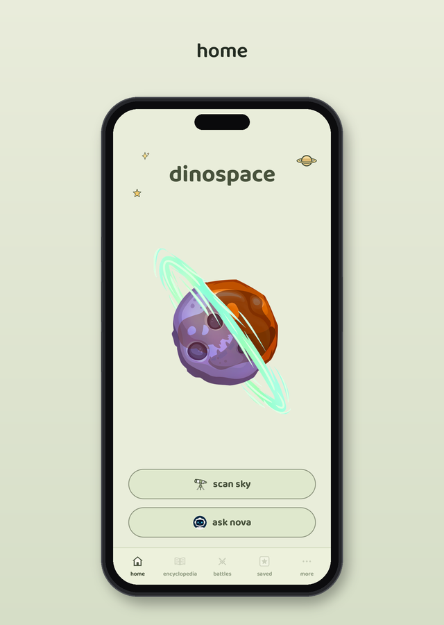
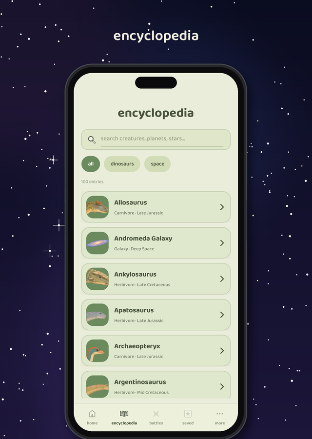
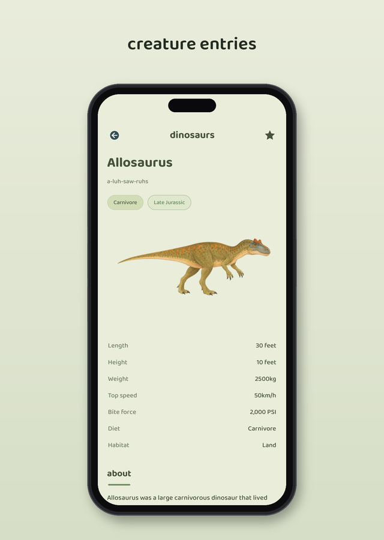
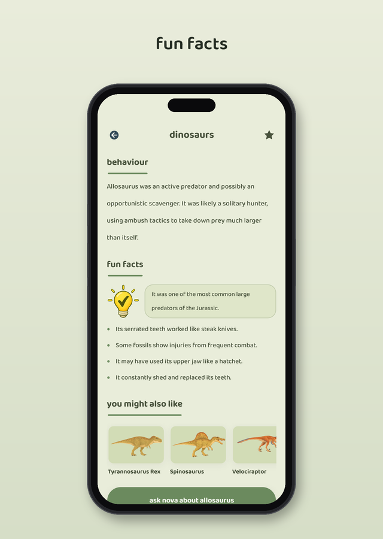
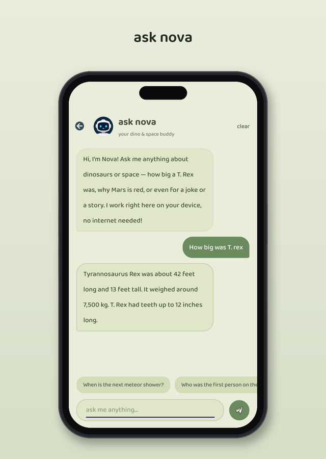
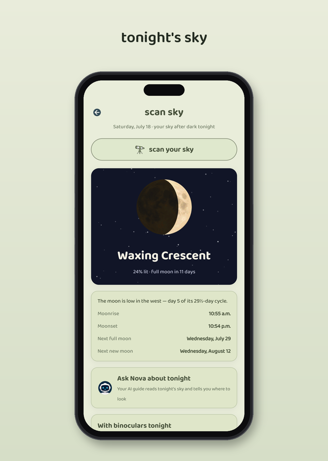
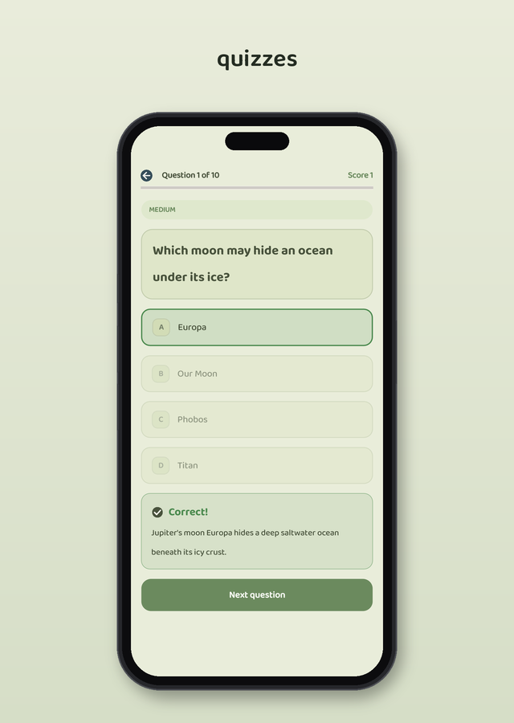
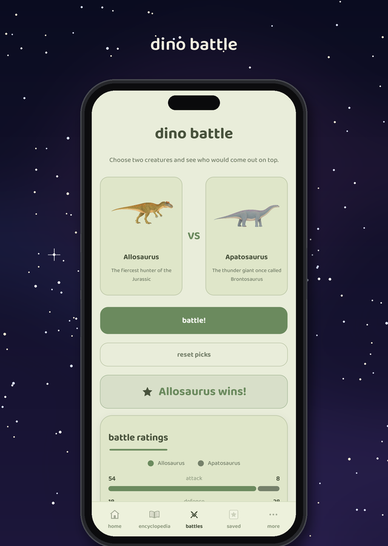
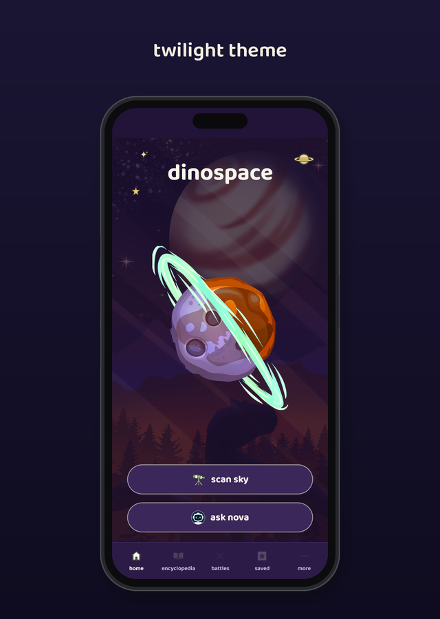
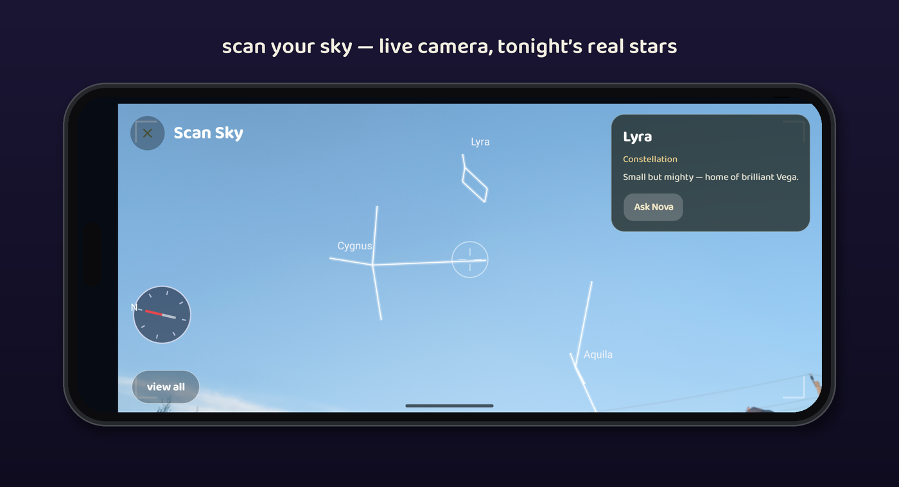

<p align="center">
  
</p>

<h1 align="center">DinoSpace</h1>

<p align="center">
  A dinosaur &amp; space encyclopedia for kids.<br>
  Fully offline. No ads, no accounts, no data collected.
</p>

<p align="center">
  <a href="https://play.google.com/store/apps/details?id=com.dinospace.kids">
    
  </a>
</p>

<p align="center">
  <a href="https://karthikeya0923.github.io/dinospace/">Website</a>&ensp;·&ensp;<a href="https://karthikeya0923.github.io/dinospace/privacy.html">Privacy policy</a>&ensp;·&ensp;<a href="#getting-around">Getting around</a>&ensp;·&ensp;<a href="#for-developers">For developers</a>
</p>

<p align="center"><sub>Free on Google Play · Android 8.0 and up · rated for everyone.</sub></p>

<br>

<table>
  <tr>
    <td></td>
    <td></td>
    <td></td>
  </tr>
  <tr>
    <td></td>
    <td></td>
    <td></td>
  </tr>
  <tr>
    <td></td>
    <td></td>
    <td></td>
  </tr>
</table>

<p align="center">
  
</p>

## Getting started

Install it, open it, and you're in. There is no sign-up, no account and no setup screen, and every feature except the optional AI download works with the phone in aeroplane mode.

Two permissions are asked for, both optional and both refusable without losing the app: **location** (so the sky report matches where you actually are) and **camera** (so Scan Sky can draw the stars over the real sky).

## Getting around

The bar along the bottom is the whole app. Five tabs, always there:

| Tab | What it is |
| --- | --- |
| **home** | The cover page. Two buttons: **scan sky** and **ask nova**. |
| **encyclopedia** | All 100 entries — 50 prehistoric creatures, 50 space objects — searchable and A→Z. |
| **battles** | Pick two creatures and see who would win. |
| **saved** | Everything you starred, in one place. |
| **more** | A grid of everything else: quiz, drawing studio, collections, settings. |

Three gestures are worth knowing:

- **Swipe left or right** on any tab to slide to the next one.
- **Swipe in from the left edge** of any page to go back.
- **The phone's back button** jumps to home from any other tab.

Nothing is ever more than two taps away — anything not on a tab is on the **more** grid.

## Doing things

**Look something up.** Open **encyclopedia**, type into the search box — it filters as you type — or use the **All / Dinosaurs / Space** buttons to narrow the list first. Tap any row to open the entry.

**Read an entry.** Each one opens with its name, how to say it, its tags and the drawing, then a plain table of stats — length, weight, bite force and speed for a creature; type, distance, size and the like for a space object. Below that: About, Key features, and the sections that suit it (Habitat and Behaviour for creatures, Orbit and Surface for space), then Fun facts. At the bottom are related entries, an **Ask Nova about this** button, and for creatures a **Battle this creature** button. The star in the top-right saves it.

**Keep favourites.** Tap the star on any entry, or open the **saved** tab and use the **+** in the corner — that opens a search list where every tap stars an entry, so several go in at once.

**Scan the sky.** Home → **scan sky** opens tonight's report: the moon drawn at its real phase, what's worth a look with binoculars, the next meteor shower, which planets and constellations are up and where, and sunrise/sunset. **Scan your sky** at the top opens the live camera view — hold the phone up and it labels only what is genuinely above you. Tap **view all** to show every star name, the crosshair names whatever it lands on, and **Learn more** or **Ask Nova** opens that object. **Learn the sky** near the bottom of the report explains what all of it means.

**Ask Nova.** Home → **ask nova**. Type a question, or tap one of the suggested ones. Nova answers on the phone itself — nothing typed there ever leaves the device. It handles facts, jokes, stories and open-ended questions, and works straight away; the optional AI model in Settings only makes the open-ended answers longer.

**Take a quiz.** more → **quiz**. Choose Dinosaurs, Space or Mixed, drag the slider to anywhere from 5 to 100 questions, then **START QUIZ**. Every answer comes with an explanation, and the score is kept on your profile.

**Battle two creatures.** The **battles** tab (or **Battle this creature** on any entry). Tap each side to pick a creature, hit **battle!**, and the winner is worked out from size, weight, bite force and speed. **Reset** picks again. If you have drawn your own creatures, one switch lets them into the ring.

**Draw your own.** more → **draw entry** → **Create something new**. Step one is the canvas: five brushes, an eraser, a fill bucket, a colour palette with a mixer, brush sizes, undo and redo. **Next** goes to step two, where you name it and fill in its stats and facts. Save, and it becomes a full encyclopedia entry that can fight in battles.

**Browse collections.** more → **collections**. Ranked lists like *Biggest Creatures Ever*, *Strongest Bites* and *Farthest From Earth*, plus **Make your own list** — name it, add any mix of creatures and space objects, and it saves as you type.

## Settings

more → **settings**, at the bottom of the grid.

- **Appearance** — two looks, a soft pastel storybook and a hand-painted twilight, plus four text sizes. Both apply instantly across the app.
- **Sound & haptics** — the little buzz on taps, on or off.
- **Parent mode** — set a 4-digit PIN, then choose whether **Ask Nova** and **Scan Sky** are open. The encyclopedia, quizzes, battles and drawing always stay on. Changing any of it needs the PIN.
- **Nova AI** — download, pause or remove the optional on-device model.
- **Privacy**, **About**, **Contact us**, and a reset that clears progress, bookmarks and the Nova chat.

Tapping the **You** card at the top of Settings opens your profile: entries discovered, favourites, creations, day streak and lifetime quiz scores.

## For developers

**Stack** — .NET MAUI (`net10.0-android`, with iOS, Mac Catalyst and Windows heads), C# only. Every screen is built in code; there are no XAML pages, just one small component kit themed at runtime.

```bash
dotnet build dinospace/dinospace.csproj -f net10.0-android -c Debug
```

**Layout** — `Views/` one file per screen (`RootPage` owns the tab bar and the finger-tracking pager), `Ui/` the component kit and theme, `Services/` the offline engines and stores, `Data/` the 100 entries, quiz bank and knowledge base, `tools/AnswerHarness/` the answer-pipeline test harness.

**In-house engines**

- **[SkyScanner](https://github.com/Karthikeya0923/SkyScanner)** — the astronomy behind every sky feature. Positions verified against NASA JPL Horizons to within hundredths of a degree, fully offline.
- **[NovaSaur](https://github.com/Karthikeya0923/novasaur)** — runs Google's Gemma locally through LiteRT-LM, so the chat needs no network at all.

## Privacy

Built for kids, so the bar is absolute: no ads, no purchases, no accounts, no analytics, no tracking, no data collection of any kind. Location and camera are optional, processed on the device, and never stored or transmitted.

Full details: [privacy policy](https://karthikeya0923.github.io/dinospace/privacy.html).

## License

GPL-3.0 — see [LICENSE](LICENSE).
